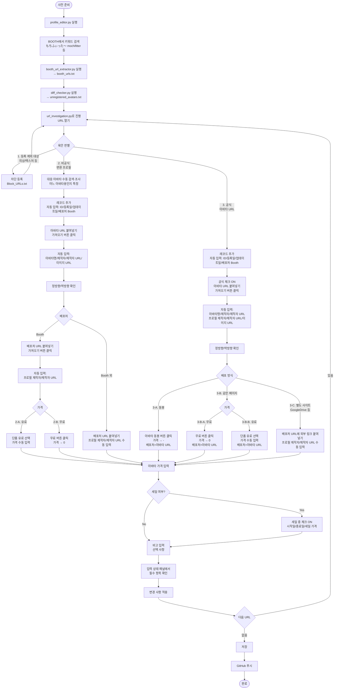

# 모치피터 프로필 목록

VRChat용 아바타의 「모치피터」 대응 프로필 정보를 정리한 정적 웹사이트와 관리 도구 모음입니다.

## 내용

### 웹페이지

- **index.html** - 메인 목록 페이지(검색·필터 기능 포함)
- **lite.html** - 경량판 목록 페이지
- **terms.html** - 이용약관 페이지

### 관리 도구

- **profile_editor.py** - 프로필 편집 GUI
- **booth_url_extractor.py** - Booth URL 추출
- **diff_checker.py** - 프로필 차이점 확인
- **url_investigation.py** - URL 조사 도구
- **check_new_profiles.py** - 신규 프로필 자동 확인(GitHub Actions용)

### 개발 도구

- **scripts/server.py** - 로컬 개발용 HTTP 서버
- **scripts/start_server.bat** - 서버 실행용 배치 파일(Windows)

### 데이터

- **data/profiles.json** - 프로필 정보(아바타명, 제작자, 배포처 등)
- **data/Block_URLs.txt** - 제외할 Booth 상품 URL(선택 사항)
- **data/Avatar_URLs.txt** - 제외할 아바타 URL(선택 사항)

## 로컬 개발 서버

웹페이지를 로컬 환경에서 확인하기 위한 간단한 HTTP 서버를 제공합니다.

### 실행 방법

#### Windows(배치 파일)

1. `scripts/start_server.bat` 를 더블클릭
2. 브라우저가 자동으로 열리고 사이트가 표시됩니다
3. 종료하려면 콘솔 창에서 `Ctrl+C` 를 누르세요

#### 명령줄(모든 OS 지원)

```bash
# 기본 실행(포트 8000, 브라우저 자동 열기)
python scripts/server.py

# 포트 번호 지정
python scripts/server.py --port 3000

# 브라우저를 열지 않고 실행
python scripts/server.py --no-browser

# 도움말 표시
python scripts/server.py --help
```

### 접속 URL

서버 실행 후 아래 URL로 접속할 수 있습니다.

- 메인 페이지: `http://localhost:8000/`
- 이용약관: `http://localhost:8000/terms.html`
- 경량판: `http://localhost:8000/lite.html`

### 필요한 환경

- Python 3.6 이상(표준 라이브러리만 사용, 추가 패키지 불필요)

## 자동 확인 기능

GitHub Actions를 사용해 Booth의 새로운 프로필을 자동으로 확인합니다.

**자세한 설정 방법은 [SETUP_GUIDE.md](SETUP_GUIDE.md)를 참고하세요.**

### 설정 방법(개요)

1. **Discord Webhook 설정**
   - Discord에서 채널 설정으로 들어가 Webhook URL을 가져옵니다
   - GitHub 저장소의 Settings > Secrets and variables > Actions 로 이동합니다
   - `DISCORD_WEBHOOK_URL` 이름으로 시크릿을 추가합니다

2. **실행 일정**
   - 2시간마다 자동 실행됩니다
   - 수동 실행도 가능합니다(Actions 탭에서 `Check New Booth Profiles` 선택)

3. **확인 대상 URL**
   - `https://booth.pm/ja/browse/3Dキャラクター?q=もちふぃった`
   - `https://booth.pm/ja/browse/3Dキャラクター?q=mochifitter`
   - `https://booth.pm/ja/browse/3Dモデル（その他）?q=もちふぃった`
   - `https://booth.pm/ja/browse/3Dモデル（その他）?q=mochifitter`
   - `https://booth.pm/ja/browse/3Dツール・システム?q=もちふぃった`
   - `https://booth.pm/ja/browse/3Dツール・システム?q=mochifitter`
   - `https://booth.pm/ja/browse/VRoid?q=もちふぃった`
   - `https://booth.pm/ja/browse/VRoid?q=mochifitter`

### 동작 방식

1. 위 검색 URL에서 상품 URL을 수집합니다
2. `profiles.json`, `Block_URLs.txt`, `Avatar_URLs.txt`와 대조합니다
3. 미등록 상품이 있으면:
   - Discord Webhook으로 알림을 보냅니다
   - `unregistered_avatars.txt`를 Artifact로 저장합니다(30일간)
4. 미등록 상품이 없으면 정상 종료합니다

## 등록 작업 흐름



## 라이선스

MIT License
